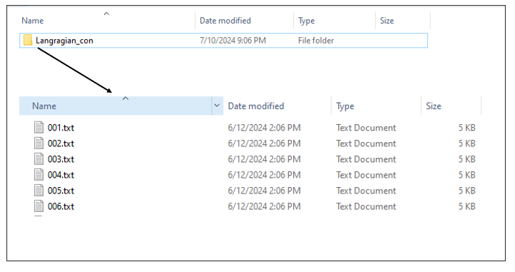

# Read connectivity data from multiple sub-folders.

Read connectivity data from multiple sub-folders.

## Usage

``` r
preprocess_graphs(path, ...)
```

## Arguments

- path:

  a path of the folder where sub-folders containing txt or csv files are
  contained. Each sub-folder has the name of the corresponding
  connectivity data. In case that a connectivity folder corresponds to a
  specific biodiversity feature, it should be named as the corresponding
  feature.

- ...:

  additional arguments passed to `read.csv`.

## Details

This is an auxiliary function for creating an edge list `data.frame`
object from multiple files, like the ones provided from softwares
estimating Lagrangian models.

Function preprocess_graphs takes as input a list of .txt/.csv objects.
Each object represents the connections between a node and all the other
nodes. For the model to read the data, it is necessary to have all the
.txt/.csv objects in one folder. There are two ways to incorporate
connectivity data, based on their linkage to features:

- Case 1: the connectivity data correspond to specific biodiversity
  features. If a biodiversity feature has its own connectivity dataset
  then the file including the edge lists needs to have the same name as
  the corresponding feature. For example, consider having 5 species (f1,
  f2, f3, f4, f5) and 5 connectivity datasets. Then the connectivity
  datasets need to be in separate folders named: f1,f2,f3,f4,f5 and the
  algorithm will understand that they correspond to the species.

- Case 2: the connectivity dataset represents a spatial pattern that is
  not directly connected with a specific biodiversity feature. Then the
  connectivity data need to be included in a separate folder named in a
  different way than the species. For example consider having 5 species
  (f1,f2,f3,f4,f5) and 1 connectivity dataset. This dataset can be
  included in a separate folder (e.g. "Langragian_con").



A typical Lagrangian output is a set of files representing the
likelihood of a point moving from an origin (source) to a destination
(target). This can be represented using a list of .txt/.csv files (as
many as the origin points) including information for the destination
probability. The .txt/.csv files need to be named in an increasing
order. The name of the files need to correspond to the numbering of the
points, in order for the algorithm to match the coordinates with the
points.


## Value

an edge list `data.frame` object, with the following columns:

- `feature`: feature name.

- `from.X`: longitude of the origin (source).

- `from.Y`: latitude of the origin (source).

- `to.X`: longitude of the destination (target).

- `to.Y`: latitude of the destination (target).

- `weight`: connection weight.

## See also

` preprocess_graphs, `[`get_metrics`](https://cadam00.github.io/priorCON/reference/get_metrics.md)` `

## Examples

``` r
# Read connectivity files from folder and combine them
combined_edge_list <- preprocess_graphs(system.file("external",
                                        package="priorCON"),
                                        header = FALSE, sep =";")
head(combined_edge_list)
```
