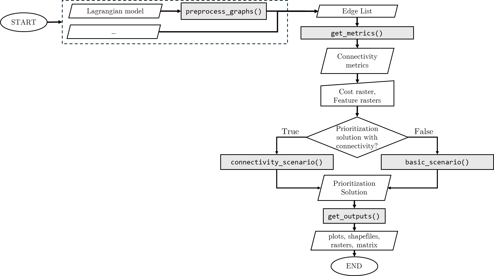
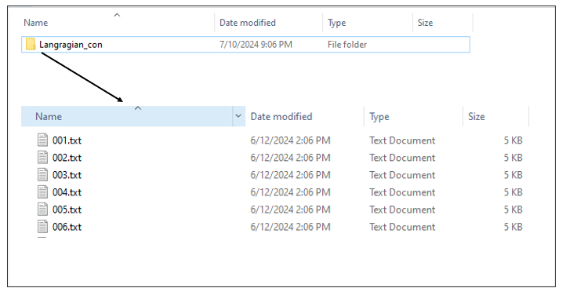
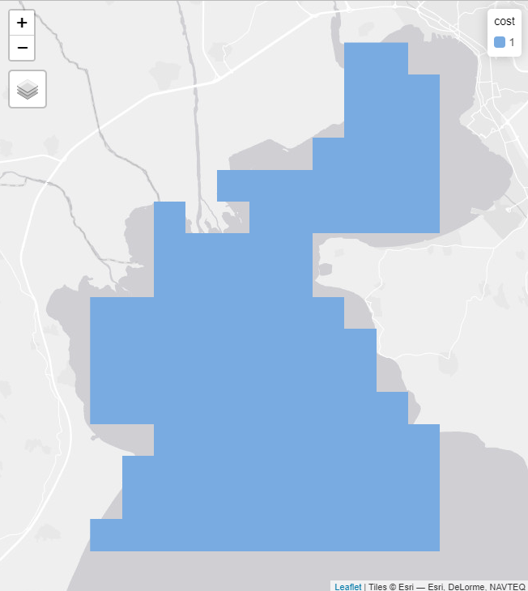

**This work was supported by the European Union’s Horizon 2020 research and innovation programme HORIZON-CL6–2021-BIODIV-01–12 under grant agreement No 101059407 “MarinePlan – Improved transdisciplinary science for effective ecosystem-based maritime spatial planning and conservation in European Seas”.**

# **Introduction to the priorCON Package (tutorial)**

The **priorCON** package offers an innovative tool-set that incorporates
graph community detection methods into systematic conservation planning.
This package is designed to enhance spatial prioritization by focusing
on the protection of areas with high ecological connectivity. Unlike
traditional approaches that prioritize individual planning units,
**priorCON** focuses on clusters of features that exhibit strong
ecological linkages. The **priorCON** package is built upon the
**prioritizr** package ([Hanson et al. 2024](#ref-prioritizr)), using
commercial and open-source exact algorithm solvers that ensure optimal
solutions to prioritization problems.

**Features of priorCON**

-   **Graph Community Detection**: The package utilizes connectivity
    metrics to identify clusters of habitat patches with high
    connectivity values.

-   **Spatial prioritization**: The package uses the connectivity
    metrics as inputs in prioritizr to identify areas with high
    connectivity.

-   **Connectivity Estimation**: The package estimates the connectivity
    protection level by calculating the protected connections.

-   **Post-processing**: The package can be used to produce and download
    the outputs of the analysis as shapefiles, matrices and tmap plots.

This workflow is shown on Fig. [1](#ref-Figure1).

```{r Figure1, eval=TRUE, echo=FALSE, out.width = '100%', fig.align = "center"}

```
<p class="caption" align="center">
<span id="ref-Figure1"></span>Fig. 1: Flow chart of the <b>priorCON</b>
prioritization analysis. <b>priorCON</b> functions are indicated in grey boxes
</p>

This tutorial will guide you through the key functions of the package,
from data preparation to generating informative outputs to address
conservation connectivity challenges in diverse ecosystems.

## **Workflow: Running the analysis**

The package provides 4 steps to perform the analysis:

1.  Preprocessing (Optional): Function `preprocess_graphs()` is built in
    order to create edge lists from various inputs formats.

2.  Connectivity metrics estimation: Function `get_metrics()` is built
    to calculate the following graph metrics: degree, eigenvector
    centrality, betweenness centrality, louvain clustering, walktrap
    clustering, s-core.

3.  Prioritization: Functions `basic_scenario()` and
    `connectivity_scenario()` are used to insert the data to **prioritizr**
    run the prioritization problem and obtain the optimum solutions.

4.  Post-processing: Function `get_outputs()` is used in order to plot
    interactive maps and export tables, shapefiles and rasters of the
    results

The functions of steps 1 and 2 can be used within the spatial
conservation planning workflow as described here but also independently
to create and obtain the graph metrics that might be also useful within
other research contexts. In the next sections we provide an illustrative
example to explain in more detail how the functions operate.

## **Illustration example**

Let us consider the following dataset as an illustrative example. The
area examined is Thermaikos gulf in Greece. In this example, a
Lagrangian model has been run to the area, to estimate connectivity.
This connectivity will be incorporated into the analysis to obtain the
areas that need to be protected to maximize the connectivity protection.
Preprocessing is necessary in this case in order to transform the
Lagrangian data in an edge list.

### Step 1 Preprocessing (Optional):

The input of an edge list is required in most graph theoretic
approaches. Fig. <a href="#ref-Figure2">2</a> represents a typical
directed weighted graph. In the edge list, the first two columns utilize
the nodes IDs to represent edges and the last column corresponds to the
value of the edges. This value actually represents the connectivity
value between the corresponding nodes and may represent for instance
values resulting from particle drift models, migration probabilities or
other. This preprocessing step can be conducted using the function
`preprocess_graphs()` and serves in reading and transforming the initial
input data into an edge list. Further details on the initial data
formats are given below. In case that an edge list is available, this
step can be skipped.

```{r Figure2, eval=TRUE, echo=FALSE, out.width = '100%', fig.align = "center"}

```
<p class="caption" align="center">
<span id="ref-Figure2"></span>Fig. 2: Weighted directed graph (left):
Circles represent nodes and arrows represent weighted edges. The tabular
representation of the graph represents the edge list (right).
</p>

Function `preprocess_graphs()` takes as input a list of .txt/.csv
objects. Each object represents the connections between a node and all
the other nodes. For the model to read the data, it is necessary to have
all the .txt/.csv objects in one folder. There are two ways to
incorporate connectivity data, based on their linkage to features:

-   Case 1: the connectivity data correspond to specific biodiversity
    features. If a biodiversity feature has its own connectivity dataset
    then the file including the edge lists needs to have the same name
    as the corresponding feature. For example, consider having 5 species
    (f1, f2, f3, f4, f5) and 5 connectivity datasets. Then the
    connectivity datasets need to be in separate folders named:
    f1,f2,f3,f4,f5 and the algorithm will understand that they
    correspond to the species.

-   Case 2: the connectivity dataset represents a spatial pattern that
    is not directly connected with a specific biodiversity feature. Then
    the connectivity data need to be included in a separate folder named
    in a different way than the species. For example consider having 5
    species (f1,f2,f3,f4,f5) and 1 connectivity dataset. This dataset
    can be included in a separate folder (e.g. “Langragian_con”).

In our example we use connectivity values that are not directly
connected with a specific species, therefore we illustrate Case 2. Fig.
<a href="#ref-Figure3">3</a> represents the structure used in the
tutorial. The data need to be stored in this way in order for the
algorithm to read them properly.

```{r Figure3, eval=TRUE, echo=FALSE, out.width = '100%', fig.align = "center"}

```
<p class="caption" align="center">
<span id="ref-Figure3"></span>Fig. 3: Connectivity folder
</p>

A typical Lagrangian output is a set of files representing the
likelihood of a point moving from an origin (source) to a destination
(target). This can be represented using a list of .txt files (as many as
the origin points) including information for the destination
probability. The .txt files need to be named in an increasing order. The
name of the files need to correspond to the numbering of the points, in
order for the algorithm to match the coordinates with the points (Fig.
<a href="#ref-Figure4">4</a>).

```{r Figure4, eval=TRUE, echo=FALSE, out.width = '100%', fig.align = "center"}
knitr::include_graphics("priorCON_fig4.png")
```
<p class="caption" align="center">
<span id="ref-Figure4"></span>Fig. 4: The 001.txt file contains the
following information: Each row represents the probability of movement
between point 001 and any other destination points.
</p>

As long as the data are set in this way, the preprocessing algorithm can
run and transform the format of the inputs to an edge list. If an edge
list dataset is available, this preprocessing step can be skipped.

``` r
# Import packages
library(priorCON)
library(tmap)
library(terra)

# Read connectivity files from folder and combine them
  combined_edge_list <- preprocess_graphs(
    system.file("external",package="priorCON"),
    header = FALSE, sep =";"
   )
```

### Step 2 Connectivity Metrics Estimation:

Function `get_metrics()` is used to calculate graph metrics values. The
edge lists created from the previous step, or inserted directly from the
user are used in this step to create graphs. The directed graphs are
transformed to undirected. The function is based on the **igraph**
package ([Csárdi and Nepusz 2006](#ref-csardi2006igraph); [Csárdi et al.
2024](#ref-igraph)) which is used to create clusters using Louvain and
Walktrap and calculate the following metrics: Eigenvector Centrality,
Betweenness Centrality and Degree. S-core is calculated using the
package **brainGraph** ([Watson 2024](#ref-brainGraph)). The user can
choose between these options to create the respective outputs.
`'s_core'`, `'louvain'`, `'walktrap'`, `'eigen'`, `'betw'` or `'deg'`.

Detailed information on the theory and equations of the used graph
metrics are provided in Nagkoulis et al.(2024; subm Methods in Ecology
and Evolution).

``` r
# Set seed for reproducibility
set.seed(42)

# Detect graph communities using the s-core algorithm
pre_graphs <- get_metrics(combined_edge_list, which_community = "s_core")
```

### Step 3 Prioritization:
Two alternative functions can be used for the
prioritization step: i) the `connectivity_scenario()` function, which
includes connectivity into the optimization procedure and ii) the
`basic_scenario()` function, which does not include connectivity. The
two functions can be run separately. Users may use both functions, if
they wish to compare the results obtained from the two scenarios,
i.e. with and without connectivity. Alternatively, only the
`connectivity_scenario()` function can be run to obtain the
prioritization outputs of the connectivity scenario. Both functions are
based on the **priorititizr** package ([Hanson et al.
2024](#ref-prioritizr)). The connectivity metrics are first transformed
to rasters, following an approach similar to Marxan Connect ([Daigle et
al. 2020](#ref-daigle2020operationalizing)). Then **priorititizr**
maximizes the utility obtained from protecting both features and
connections. Mathematically, the target of the optimization is to
maximize U under the budget (B) limitations (eq. 2 and 3 of Nagkoulis et
al.(2024)):

$$
U = \sum_{\boldsymbol{PU_i} \, \in \,SA} -\lambda c_i + \sum_{\boldsymbol{PU_i} \, \in \,SA} \sum_{j=1}^J \mu_j f_j + \sum_{\boldsymbol{PU_i} \, \in \,SA} \sum_{j=1}^J \mu_j M_j,
$$

$$
\sum_{\boldsymbol{PU_i} \, \in \,SA} c_i \leq B
$$

A set of planning units $\boldsymbol{A}=(\boldsymbol{PU}_1, \boldsymbol{PU}_2, ..., \boldsymbol{PU_i}, ..., \boldsymbol{PU_i})$ is considered to be protected when $\boldsymbol{PU_i} \, \in \, SA$. The protection of any $\boldsymbol{PU_i}$ results in a cost $c_i$. A finite set of features $\boldsymbol{F}=(F_1, F_2, ... , F_j, ..., F_J)$ is also distributed in $A$, suggesting that these features can be spatially mapped within the PUs. Each $PU$ is thus defined as a spatial object containing the following properties: $\boldsymbol{PU_i}=(f_1, f_2, ..., f_j, ..., f_J, c_i)$, where $f_j$ indicates the quantity of $F_j$ located in $PU_i$. We use the annotation $M_j$ for the values of the metric for every feature $j$. By inserting metrics into the analysis, each PU’s ($\boldsymbol{PU_i}$) properties are extended and can be expressed as follows: $\boldsymbol{PU_i} = (f_1, f_2, ..., f_j, ..., f_J, M_1, M_2, ..., M_j, ..., M_J, c_i)$.

The first input that can be given to the algorithm is a typical cost
layer representing the cost of protecting each single planning unit.
This cost layer is inserted to **prioritizr**. If such a cost layer is
not available, a cost layer with all planning units having equal cost
can be inserted (Fig. <a href="#ref-Costraster">5</a>. The algorithm
needs a cost layer, in order to determine the planning units.

``` r
# Set tmap to “view” mode
tmap_mode("view")

# Read the cost raster
cost_raster <- get_cost_raster()

# Plot the cost raster with tmap
tm_shape(cost_raster) +
  tm_raster(title = "cost")
```

```{r Costraster, eval=TRUE, echo=FALSE, out.width = '70%', fig.align = "center"}

```
<p class="caption" align="center">
<span id="ref-Costraster"></span>Fig. 5: Cost raster
</p>

The second input are the features rasters. In case such rasters are not
available, a raster with equal values can be given to the algorithm. In
this case we have used such a pseudo-raster, adding some noise to
improve the performance of the algorithm.

``` r
# Read the features raster
features <- get_features_raster()

# Plot the features raster with tmap
tm_shape(features) +
  tm_raster(title = "f1")
```

```{r Features, eval=TRUE, echo=FALSE, out.width = '70%', fig.align = "center"}

```
<p class="caption" align="center">
<span id="ref-Features"></span>Fig. 6: Features raster
</p>

``` r
# Solve an ordinary prioritizr prioritization problem
basic_solution <- basic_scenario(
                    cost_raster = cost_raster,
                    features    = features,
                    budget_perc = 0.1
                  )

# Solve a prioritizr prioritization problem,
# by incorporating graph connectivity of the features
connectivity_solution <- connectivity_scenario(
                           cost_raster = cost_raster,
                           features    = features,
                           budget_perc = 0.1,
                           pre_graphs  = pre_graphs
                         )
```

### Step 4: Post-processing:

The results obtained from **prioritizr** are presented using matrices
and plots, allowing the user to compare the outcomes of incorporating
connectivity metrics in the analysis. Function `get_outputs()` takes as
input a prioritization solution. The user can also get the outputs as
shapefiles and raster to use them in their analysis.

``` r
 # Get outputs from basic_scenario function for feature “f1”
basic_outputs <- get_outputs(solution   = basic_solution, 
                             feature    = "f1",
                             pre_graphs = pre_graphs)
basic_outputs$tmap
```

```{r Basic, eval=TRUE, echo=FALSE, out.width = '70%', fig.align = "center"}
knitr::include_graphics("basic_output.png")
```
<p class="caption" align="center">
<span id="ref-Basic"></span>Fig. 7: Basic solution with connections
shown
</p>

``` r
# Print summary of features and connections held
# percentages for basic scenario
print(basic_outputs$connectivity_table)
```

``` r
##  feature relative_held connections(%)
## 1     f1      0.178563              0
```

``` r
# Get outputs from connectivity_scenario function for feature “f1”
connectivity_outputs <- get_outputs(solution   = connectivity_solution,
                                    feature    = "f1",
                                    pre_graphs = pre_graphs)
connectivity_outputs$tmap
```

```{r Connectivity, eval=TRUE, echo=FALSE, out.width = '70%', fig.align = "center"}
knitr::include_graphics("connectivity_output.png")
```
<p class="caption" align="center">
<span id="ref-Connectivity"></span>Fig. 8: Connectivity solution with
connections shown
</p>

``` r
# Print summary of features and connections held percentages
# for connectivity scenario
print(connectivity_outputs$connectivity_table)
```

``` r
##  feature relative_held connections(%)
## 1     f1     0.1637209      0.3339886
```

## **References**

Csárdi, Gábor, and Tamás Nepusz. 2006.
“<span class="nocase" id="ref-csardi2006igraph">The igraph
software package for complex network research</span>.” *InterJournal*
Complex Systems: 1695. [https://igraph.org](https://igraph.org).

Csárdi, Gábor, Tamás Nepusz, Vincent Traag, Szabolcs Horvát, Fabio
Zanini, Daniel Noom, and Kirill Müller. 2024.
*<span class="nocase" id="ref-igraph">
igraph: Network Analysis and Visualization in
R</span>*. [https://doi.org/10.5281/zenodo.7682609](https://doi.org/10.5281/zenodo.7682609).

Daigle, Rémi M., Anna Metaxas, Arieanna C. Balbar, Jennifer McGowan,
Eric A. Treml, Caitlin D. Kuempel, Hugh P. Possingham, and Maria Beger.
2020. “<span class="nocase" id="ref-daigle2020operationalizing">
Operationalizing ecological connectivity in
spatial conservation planning with Marxan Connect</span>.” *Methods in
Ecology and Evolution* 11 (4): 570–79.
https://doi.org/10.1111/2041-210X.13349.

Hanson, Jeffrey O, Richard Schuster, Nina Morrell, Matthew
Strimas-Mackey, Brandon P M Edwards, Matthew E Watts, Peter Arcese,
Joseph R Bennett, and Hugh P Possingham. 2024.
*<span class="nocase" id="ref-prioritizr">
prioritizr: Systematic Conservation Prioritization
in R</span>*. [https://CRAN.R-project.org/package=prioritizr](https://CRAN.R-project.org/package=prioritizr).

Watson, Christopher G. 2024. *<span class="nocase" id="ref-brainGraph">brainGraph: Graph
Theory Analysis of Brain MRI Data</span>*.
[https://doi.org/10.32614/CRAN.package.brainGraph](https://doi.org/10.32614/CRAN.package.brainGraph).
